# 爬取知乎的内容
考虑到将写的内容爬取下来，保存起来的避免误删，算是个备份的，而且方便查找，阅读起来也更方便，使用起来也好很多 <br>
 
## 亮点
1、保存**回答**到**pdf**、**markdown**，并保存相应的图片、codes以及website，排版基本按照网页，**支持保存数学公式到markdown**，回答会保存提问和自己的回答<br>

2、保存**article**到**pdf**、**markdown**，并保存相应的图片、codes以及website，排版基本按照网页，**支持保存数学公式到markdown**<br>

3、保存**想法**到text并保存相应的图片，最后对所有text进行汇总到一个档案<br>

## LOG
-----------20230729 使用beautifulsoup库来进行解析网页，使用起来更加稳定的而且排版更加贴近网页，之前是使用的selenium

-----------202306 上传

### 爬取到的想法展示
按照发布时间分目录存放，保存了图片以及文本文件<br>
<a href="./think">点击即可进入think目录查看的</a><br>
<a href="https://www.zhihu.com/pin/1600115571529302017">2023-01-21 13:01</a><br>
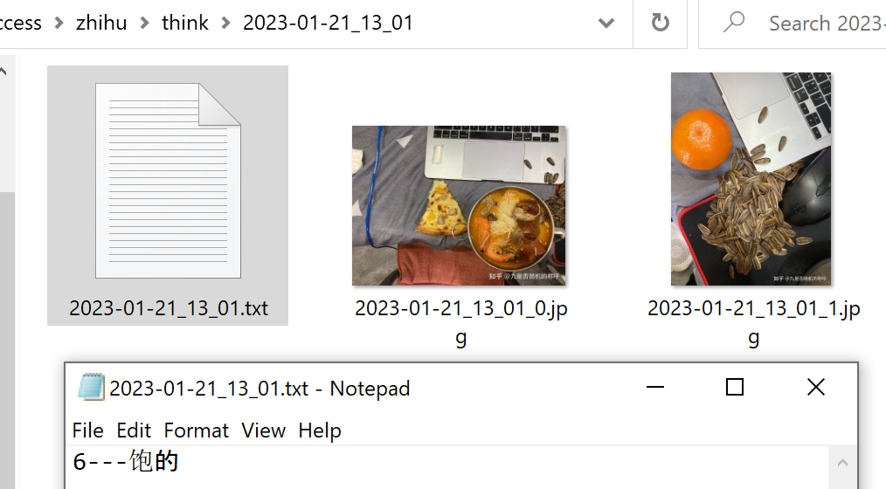 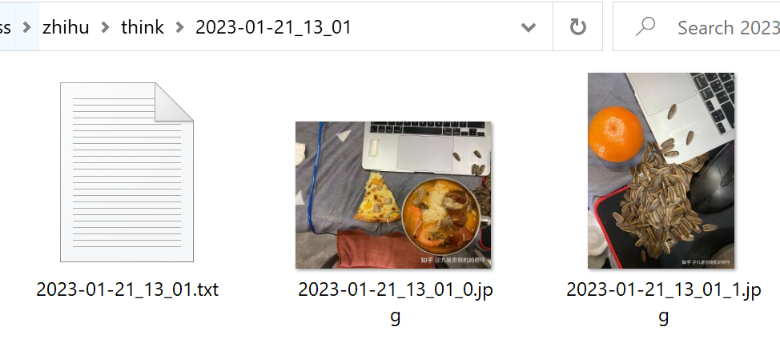 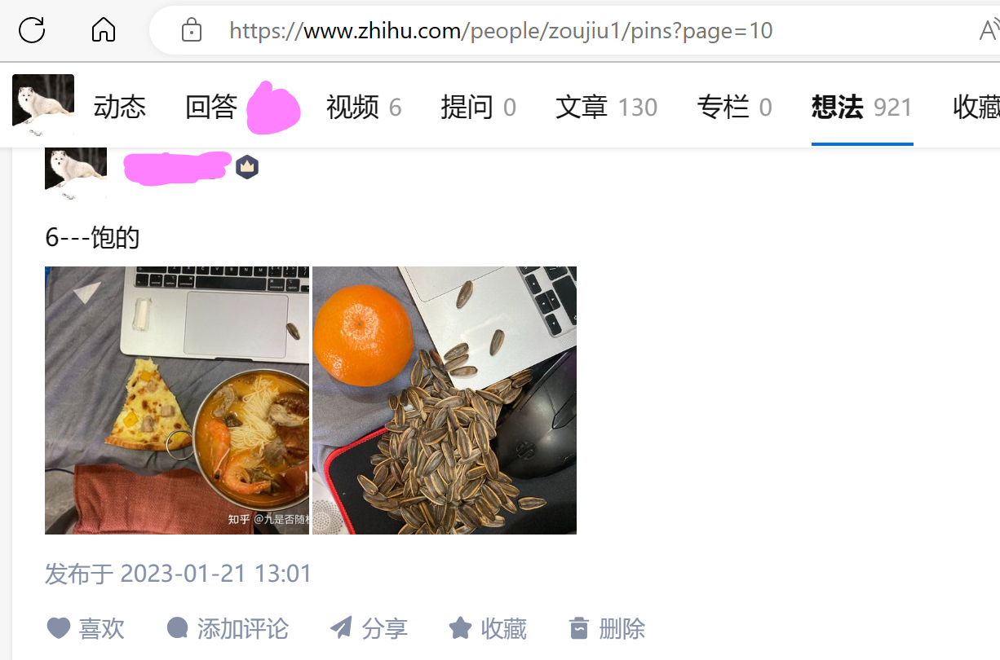<br>

### 爬取到的article展示
<a href="./article">点击即可进入article目录查看的</a><br>
每篇article都附带了修改时间和IP属地<br>


<span style="color:#7a3e9d;"><b>保存到Markdown格式的数学公式、codes和图片</b></span><br>
<a href="https://zhuanlan.zhihu.com/p/622433720">泰勒公式推导方式</a> <br>
<a href="https://zhuanlan.zhihu.com/p/605710105">c++_set运算符重载</a><br>
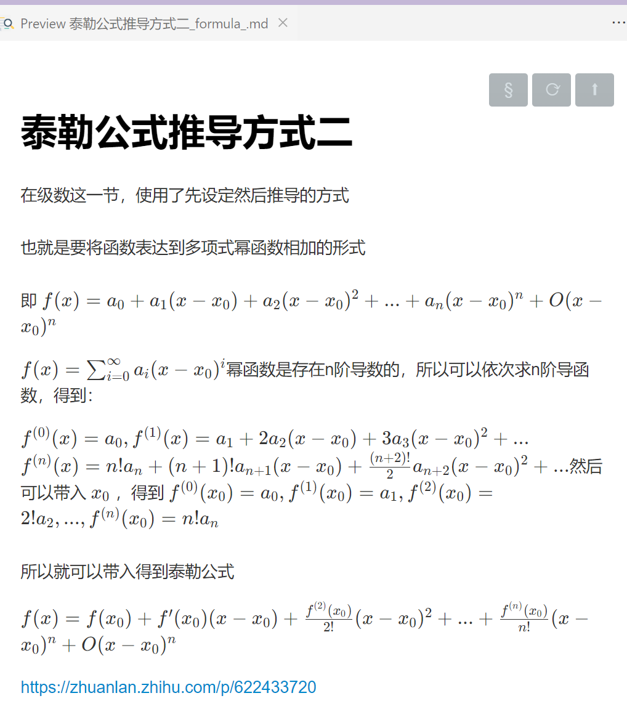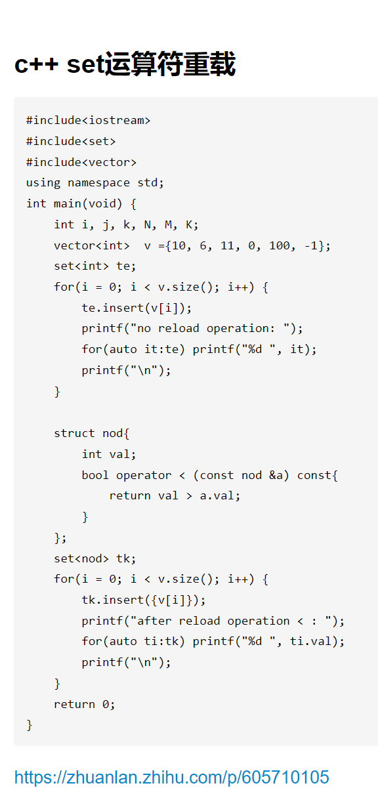<br>

<span style="color:#7a3e9d;"><b>保存到PDF格式的，标题下面是网址</b></span><br>
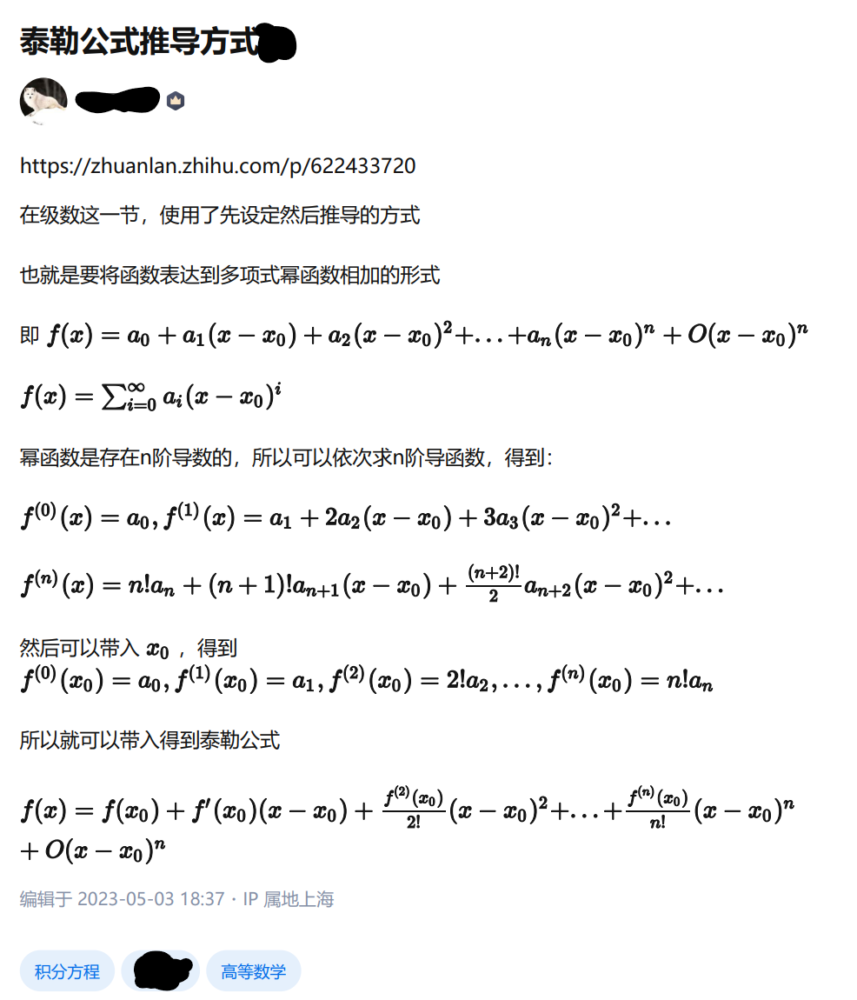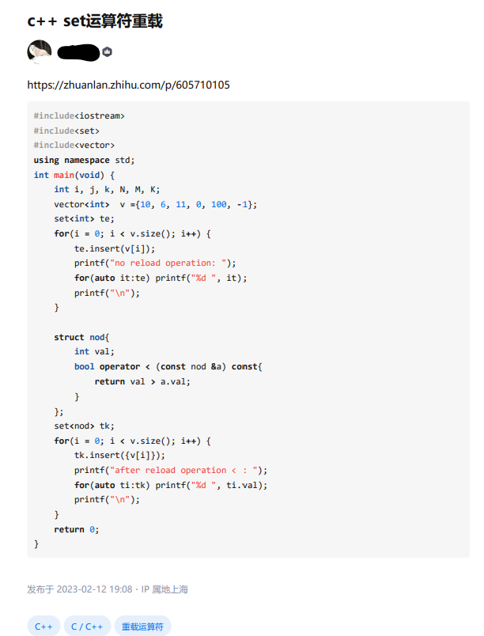<br>

### 爬取到的回答展示
<a href="./answer">点击即可进入answer目录查看的</a><br>
每篇回答也附带了修改时间和IP属地<br>

<span style="color:#7a3e9d;"><b>保存到Markdown格式的数学公式、codes和图片</b></span><br>
<a href="https://www.zhihu.com/question/605881267/answer/3075609886">矩阵A正定，证A的逆矩阵和伴随矩阵也正定</a> <br>
<a href="https://www.zhihu.com/question/30315894/answer/3089595368">Visual_Studio_Code_怎么编写运行_C、C++_程序</a><br>
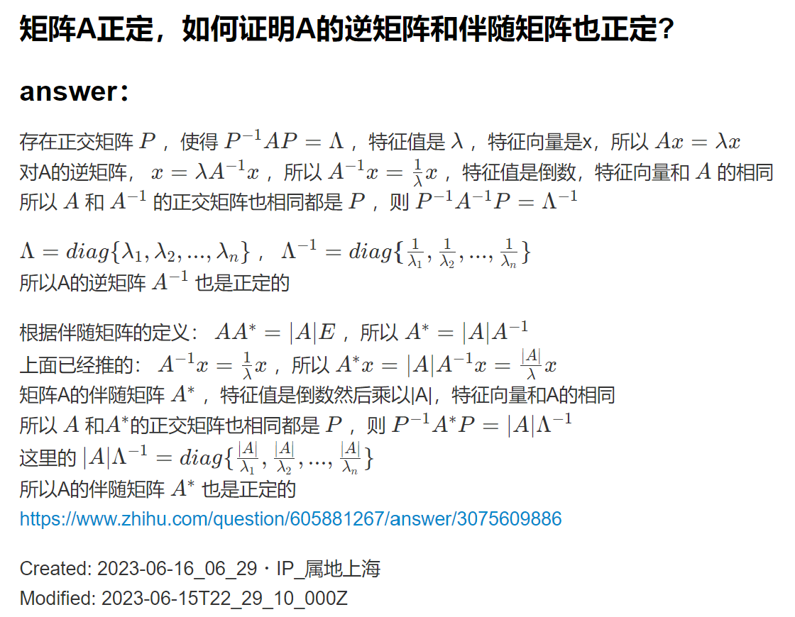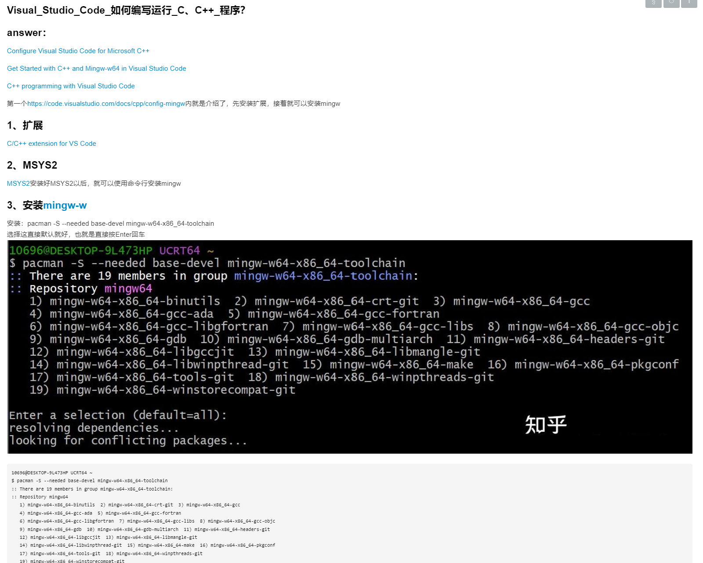<br>

<span style="color:#7a3e9d;"><b>保存到PDF格式的，标题下面是网址</b></span><br>
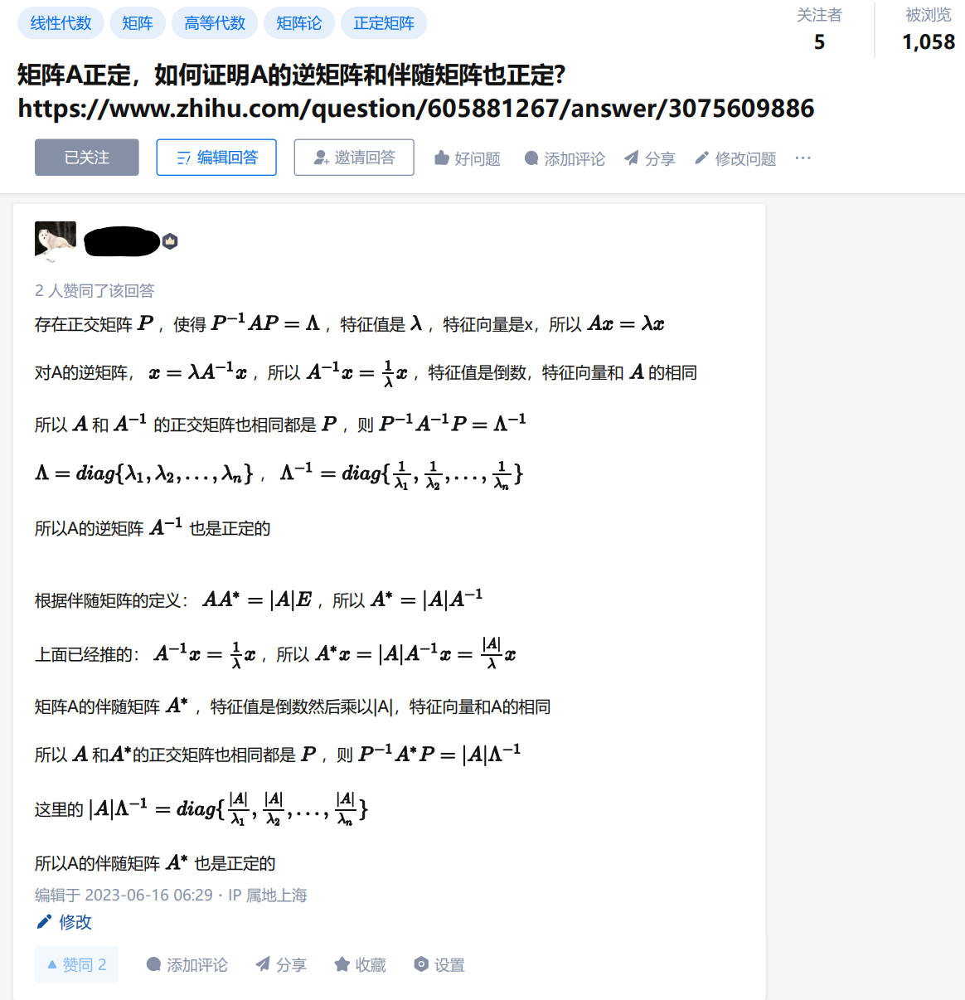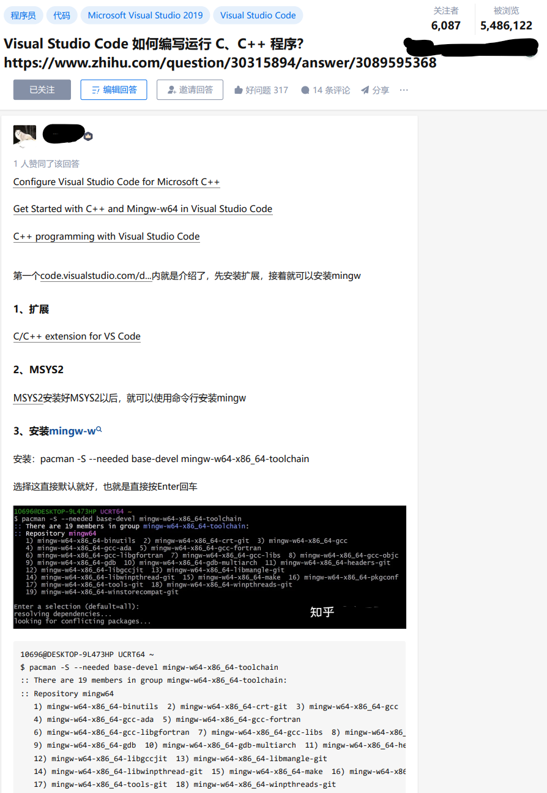<br>

## 环境以及安装
**win10** **python** <br>
1、点击下面这个网页，安装miniconda也就是安装python，下载好以后安装即可，在安装时需要加入到系统环境变量，勾选下图第二个框即可。 <br>[https://mirrors.tuna.tsinghua.edu.cn/anaconda/miniconda/Miniconda3-py310_23.3.1-0-Windows-x86_64.exe](https://mirrors.tuna.tsinghua.edu.cn/anaconda/miniconda/Miniconda3-py310_23.3.1-0-Windows-x86_64.exe)<br>
 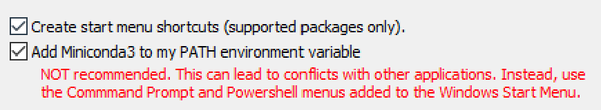<br>
2、接着需要修改python安装的路径，将msedgedriver\\.condarc这个档案放到根目录`C:\Users\username`即可，另外再打开一个cmd或者PowerShell<br>
运行`conda clean -i`输入`Y`即可，此时Python已经可以使用了<br>
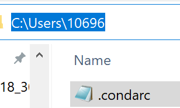 <br>
3、安装Python相关的调用库，另外再打开一个cmd或者PowerShell，运行<br>
<code>cd C:\Users\usrname\zhihu<br>
pip install -r .\requirement.txt</code><br>

## 使用
### 1、登录
运行以下内容，这一步是**手动**操作，需要人工输入账号和密码，然后点击登录就行，登录以后会自动保存好cookie(注意要等待130s程序完成运行)，以后爬取时就不用重复登录了，保存的cookie在这个目录的**cookie**，产生的档案是**cookie_zhihu.pkl**<br>
 <h3><code><b style="color:#7a3e9d;">python crawler.py </b></code></h3>
<span style="color:#7a3e9d;">运行以后会弹出一个浏览器，自动打开知乎页面以后就可以开始登录，下图所示就是登录页面，两类登录方式都可以，只要能登录就行，<a style="color:black;"><b>点击登录以后，不要再操作页面，键盘或鼠标都不可以，登录时间默认给了130s时间，130秒以后会自动退出，然后查看目录cookie是否保存好cookie_zhihu.pkl，保存好就可以开始爬取了。</b></a></span>
<br>


### 2、每项单独爬取 <br>
爬取一旦开始就自动运行了，爬取窗口一般不能最小化，可以做其他事情的 <br>
**爬取知乎想法**  <br>

默认的爬取每篇想法的睡眠时间是 **6s*图片的数量** 以上 <br>
```Bash []
python crawler.py --think --links_scratch
```

**爬取知乎回答** <br>
默认的爬取每篇回答的睡眠时间是**16s**以上，这边实际爬取耗时平均是每篇 **30s**每个图片需要6s, --MarkDown控制是否保存markdown格式的网页内容 <br>

若是PDF看起来版式太大，调小参数就可以printop.scale，不是特殊情况一般不用调整

```Bash []
python crawler.py --answer --MarkDown --links_scratch
```

**爬取知乎的article**   <br>
默认的爬取每篇article的睡眠时间是**16s**以上，这边实际爬取130多篇，耗时平均是每篇 **33.096s**每个图片需要6s  <br>

```Bash []
python crawler.py --article --MarkDown --links_scratch
```

### 3、三项一起爬取的   <br>
```Bash []
python crawler.py --think --article --answer --MarkDown --links_scratch
```

### 参数详细解释
--links_scratch：重命名*.txt，然后爬取所有的article链接+标题，或者所有的回答链接+标题。article\article.txt和answer\answers.txt都保存了链接和标题

--MarkDown：保存markdown格式的article或者回答的

--think：是否爬取想法的

--article：是否爬取article的

--answer：是否爬取回答的
<br><br>
所以，爬取所有的article或者回答的链接，需要加--links_scratch，会重命名article.txt或者answers.txt，然后生成answers.txt或者article.txt，并爬取txt的网址

```Bash []
python crawler.py --think --article --answer --MarkDown --links_scratch
python crawler.py --answer --MarkDown --links_scratch
python crawler.py --article --MarkDown --links_scratch
python crawler.py --think --MarkDown --links_scratch
```

直接爬取当前article.txt或者answers.txt的网址，则需要删除--links_scratch

```Bash []
python crawler.py --think --article --answer --MarkDown
python crawler.py --answer --MarkDown
python crawler.py --article --MarkDown
python crawler.py --think --MarkDown
```

### 又发布了一篇，只爬取写的这篇
第一次可以全部爬取，等所有article或者回答或者想法都已经爬取好以后，此时若是又写了一篇或者几篇，而且想爬取到本地，可以将<b>article/article.txt</b>这个档案重命名到<b>article/article_2023_06_20.txt</b>，或者重命名answer.txt，然后将写好的article或者回答的网址和标题按照之前档案的格式再create一个article.txt/answer.txt档案，运行爬取程序就可以了的，<b>此时需要去掉选项--links_scratch避免爬取所有链接</b>，想法会跳过已经爬取好的时间，所以可以按照上面的方式运行，此时只会爬取article.txt/answer.txt的网址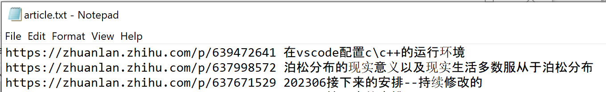
<br>
也就是

```Bash []
python crawler.py --think --article --answer --MarkDown
或者
python crawler.py --answer --MarkDown
或者
python crawler.py --article --MarkDown
或者
python crawler.py --think --MarkDown
```
<br>
若是过了很长很长时间，发布了很多篇，此时一篇一篇加入不太方便，可以直接将<b>article/article.txt</b>这个档案重命名到<b>article/article_2023_06_20.txt</b>，或者重命名answer.txt，然后运行爬取程序即可，<b>需要加入选项--links_scratch爬取所有链接</b>，上面提到了已经爬取过的不会重复爬取，所以实际只会爬取最近写好的article或者回答，想法则会直接跳过已经爬取的内容。

### 目录
<b>think</b>：该目录存放爬取到的想法内容<br>
<b>article</b>：该目录存放article的website以及爬取到的内容<br>
<b>answer</b>：该目录存放回答的website以及爬取到的内容<br>

### 注意
1、需要较好的网速，本机网速测验是下载100Mbps，上传60Mbps，低点也可以的，不是太慢太卡就行[https://www.speedtest.cn/](https://www.speedtest.cn/)<br>
2、爬取时设置了睡眠时间, 避免给知乎服务器带来太大压力，可以日间调试好，然后深夜运行爬取人少, 给其他小伙伴更好的用户体验, 避免知乎顺着网线过来找人，默认**6**s<br>
3、若是一直停在登录页面，可能是之前保存的cookie失效了，需要再次登录保存cookie

### blogs
[https://www.aliyundrive.com/s/NikyVRJq8JV   阿里云分享的](https://www.aliyundrive.com/s/NikyVRJq8JV) `提取  0h3l` <br>
[爬取知乎发布的想法和文篇和回答](https://zhuanlan.zhihu.com/p/641141948)<br>
[爬取CSDN发布的文篇](https://zhuanlan.zhihu.com/p/641140892)<br>
[https://zoujiu.blog.csdn.net/article/details/131514422](https://zoujiu.blog.csdn.net/article/details/131514422)<br>
[https://zoujiu.blog.csdn.net/article/details/131521909](https://zoujiu.blog.csdn.net/article/details/131521909)<br>
