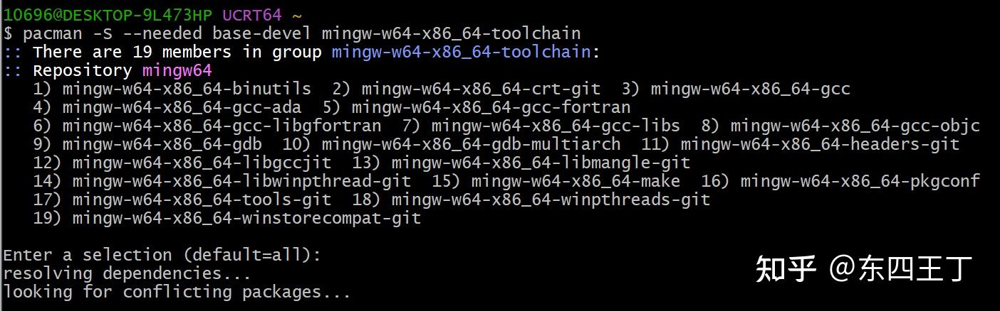
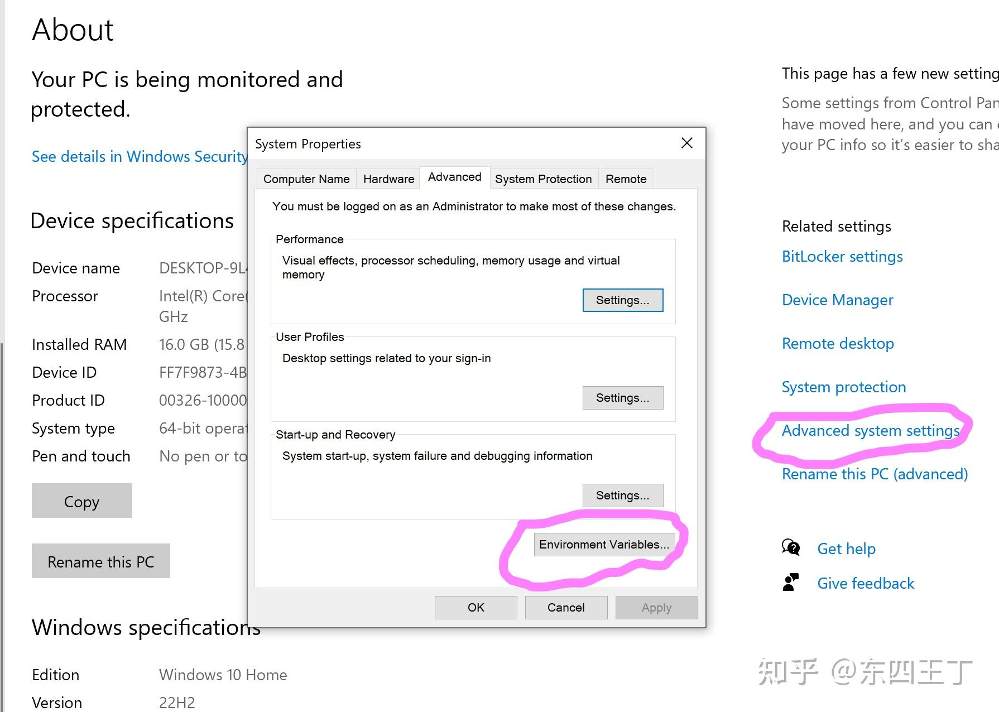
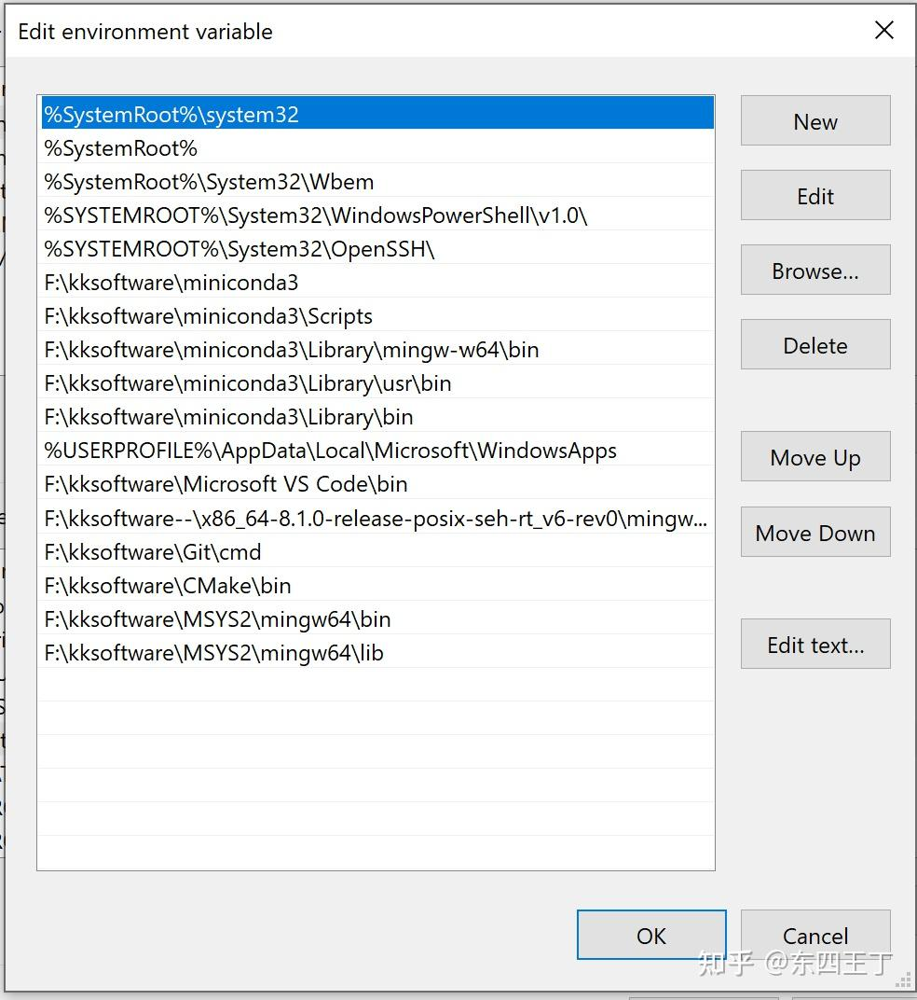
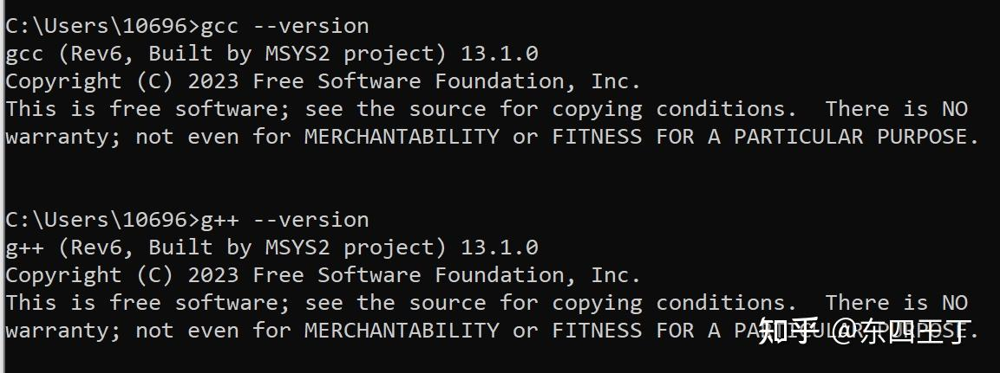
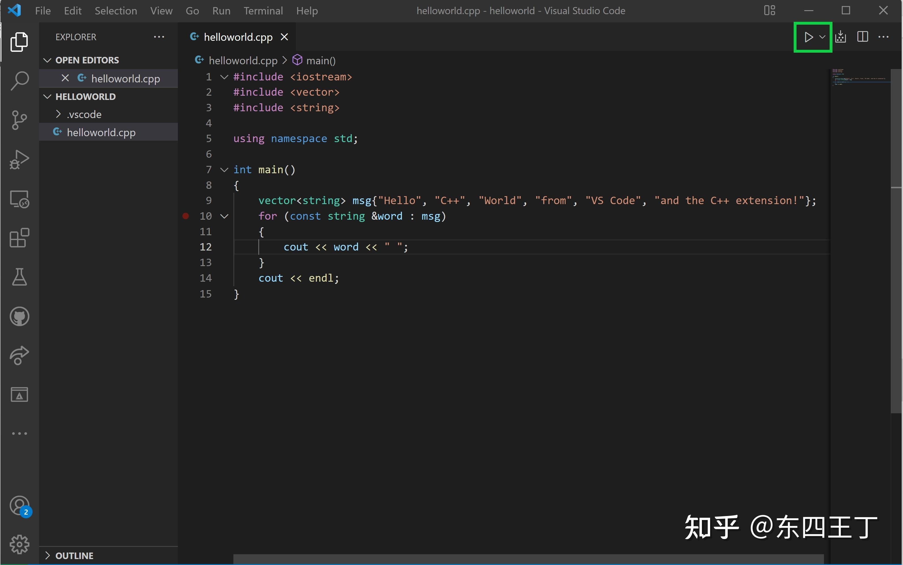
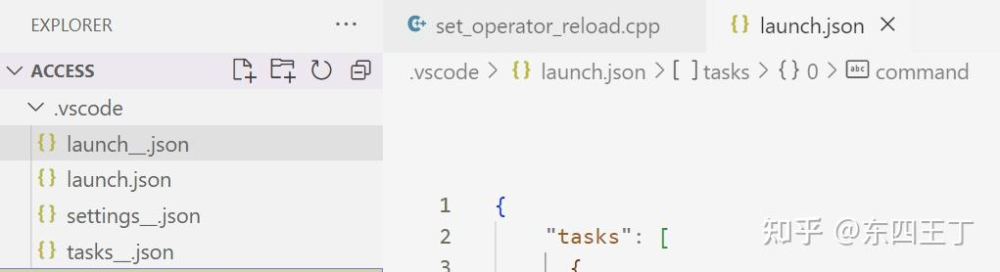
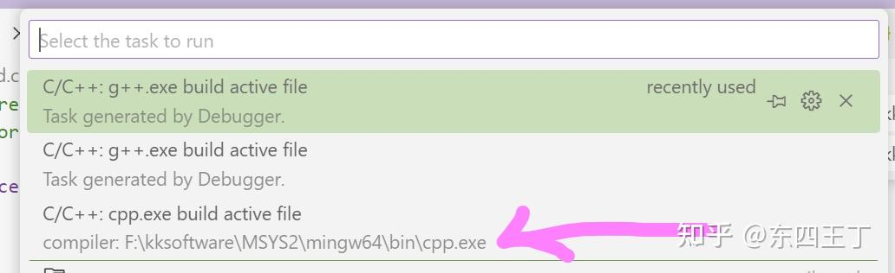

### Visual_Studio_Code_如何编写运行_C、C++_程序？

### answer： <br>
[Configure Visual Studio Code for Microsoft C++](https://code.visualstudio.com/docs/cpp/config-msvc)

[Get Started with C++ and Mingw-w64 in Visual Studio Code](https://code.visualstudio.com/docs/cpp/config-mingw)

[C++ programming with Visual Studio Code](https://code.visualstudio.com/docs/languages/cpp)

第一个[https://code.visualstudio.com/docs/cpp/config-mingw](https://code.visualstudio.com/docs/cpp/config-mingw)内就是介绍了，先安装扩展，接着就可以安装mingw

### 1、扩展
[C/C++ extension for VS Code](https://marketplace.visualstudio.com/items%3FitemName%3Dms-vscode.cpptools)

### 2、MSYS2
[MSYS2](https://www.msys2.org/)安装好MSYS2以后，就可以使用命令行安装mingw

### 3、安装[mingw-w](https://www.zhihu.com/search?q=mingw-w&search_source=Entity&hybrid_search_source=Entity&hybrid_search_extra=%7B%22sourceType%22%3A%22answer%22%2C%22sourceId%22%3A3089595368%7D)
安装：pacman -S --needed base-devel mingw-w64-x86_64-toolchain
选择这直接默认就好，也就是直接按Enter回车
  <br>
```
10696@DESKTOP-9L473HP UCRT64 ~
$ pacman -S --needed base-devel mingw-w64-x86_64-toolchain
:: There are 19 members in group mingw-w64-x86_64-toolchain:
:: Repository mingw64
   1) mingw-w64-x86_64-binutils  2) mingw-w64-x86_64-crt-git  3) mingw-w64-x86_64-gcc
   4) mingw-w64-x86_64-gcc-ada  5) mingw-w64-x86_64-gcc-fortran
   6) mingw-w64-x86_64-gcc-libgfortran  7) mingw-w64-x86_64-gcc-libs  8) mingw-w64-x86_64-gcc-objc
   9) mingw-w64-x86_64-gdb  10) mingw-w64-x86_64-gdb-multiarch  11) mingw-w64-x86_64-headers-git
   12) mingw-w64-x86_64-libgccjit  13) mingw-w64-x86_64-libmangle-git
   14) mingw-w64-x86_64-libwinpthread-git  15) mingw-w64-x86_64-make  16) mingw-w64-x86_64-pkgconf
   17) mingw-w64-x86_64-tools-git  18) mingw-w64-x86_64-winpthreads-git
   19) mingw-w64-x86_64-winstorecompat-git

Enter a selection (default=all):
resolving dependencies...
looking for conflicting packages...
......
:: Running post-transaction hooks...
(1/1) Updating the info directory file...
```
<br>
### 4、配置环境变量
win10的配置页面即可配置
  配置系统环境变量，双击PATH即可的，最下面两行
  
### 5、验证
Windows+R输入cmd运行，然后gcc --version和g++ --version就可以验证的
  
### 6、写codes
  
### 7、产生相应的配置档案
.vscode/[tasks.json](https://www.zhihu.com/search?q=tasks.json&search_source=Entity&hybrid_search_source=Entity&hybrid_search_extra=%7B%22sourceType%22%3A%22answer%22%2C%22sourceId%22%3A3089595368%7D)，编译运行使用的，两个路径的呢cwd和command
  <br>
```
{
 "tasks": [
   {
  "type": "cppbuild",
  "label": "C/C++: g++.exe build active file",
  "command": "F:\\kksoftware\\MSYS2\\mingw64\\bin\\g++.exe",
  "args": [
    "-fdiagnostics-color=always",
    "-g",
    "${file}",
    "-o",
    "${fileDirname}\\${fileBasenameNoExtension}.exe"
  ],
  "options": {
    "cwd": "F:\\kksoftware\\MSYS2\\mingw64\\bin"
  },
  "problemMatcher": ["$gcc"],
  "group": {
    "kind": "build",
    "isDefault": true
  },
  "detail": "Task generated by Debugger."
   }
 ],
 "version": "2.0.0"
  }
```
<br>.vscode/launch.json，两个路径的呢cwd和miDebuggerPath
<br>
```
{
    "version": "0.2.0",
    "configurations": [
      {
        "name": "C/C++: g++.exe build and debug active file",
        "type": "cppdbg",
        "request": "launch",
        "program": "${fileDirname}\\${fileBasenameNoExtension}.exe",
        "args": [],
        "stopAtEntry": false,
        "cwd": "F:\\kksoftware\\MSYS2\\mingw64\\bin\\",
        "environment": [],
        "externalConsole": false,
        "MIMode": "gdb",
        "miDebuggerPath": "F:\\kksoftware\\MSYS2\\mingw64\\bin\\gdb.exe",
        "setupCommands": [
          {
            "description": "Enable pretty-printing for gdb",
            "text": "-enable-pretty-printing",
            "ignoreFailures": true
          }
        ],
        "preLaunchTask": "C/C++: g++.exe build active file"
      }
    ]
  }
```
<br>
### 8、编译
编译的时候要选择相应的配置档案编译和debug
  
### 9、编译和debug的路径
编译：vscode上方：Terminal/Run Build Task
编译+运行：vscode上方：Run/Run without debugging
编译+debug：vscode上方：Run/Start debugging

<br>

[https://www.zhihu.com/question/30315894/answer/3089595368](https://www.zhihu.com/question/30315894/answer/3089595368)<br>


Created: 2023-06-25_20_00・IP_属地上海
Modified: 2023-06-25T12_00_25_000Z
